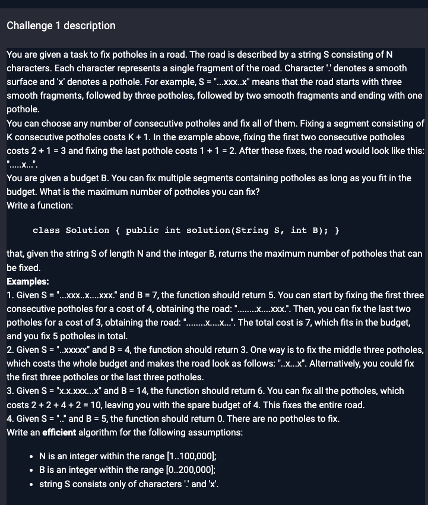

# Challenge description



# Idea

1.   Use sliding window to get the length of all the potholes, put into a list.
2.   Sort the list in descending order. (Here in the code I used priority queue)
3.   Traverse from the biggest length to smallest. If `budget` can cover, subtract it from `budget`. If not, current cost - 1 till `budget` equals 0.

# Code

```java
// you can also use imports, for example:
import java.util.*;

// you can write to stdout for debugging purposes, e.g.
// System.out.println("this is a debug message");

class Solution {
    public int solution(String s, int bud) {
        // write your code in Java 8 (Java SE 8)
        //System.out.printf("s=%s,bud=%d",s,bud);
        // Time Complexity: O(N)
        // Space Complexity: O(N)
        int n = s.length();
        int l = 0, r = 0;
        Queue<Integer> q = new PriorityQueue<>(Collections.reverseOrder());
        // record all the length of potholes, using sliding window
        while (r < n) {
            char c = s.charAt(r);
            if (c == 'x') {
                l = r;
                while (r < n && s.charAt(r) == 'x') r++;
                int len = r - l;
                q.offer(len);
            }
            else {
                r++;
            }
        }
//        System.out.println(q);
        int res = 0;
        while (!q.isEmpty()) {
            int curCost = q.poll() + 1;// cur cost
            while (curCost > 1) {
                // min cost >= 2
                if (bud >= curCost) {
                    // if budget can cover
                    res += curCost - 1;
                    bud -= curCost;
                    if (bud == 0) return res;
                    break;
                }
                else {
                    // if budget cannot, minus 1
                    curCost--;
                }
            }
        }
        return res;
    }
}
```

# Complexity Analysis

Time Complexity

O(NlogN)

Space Complexity

O(N)