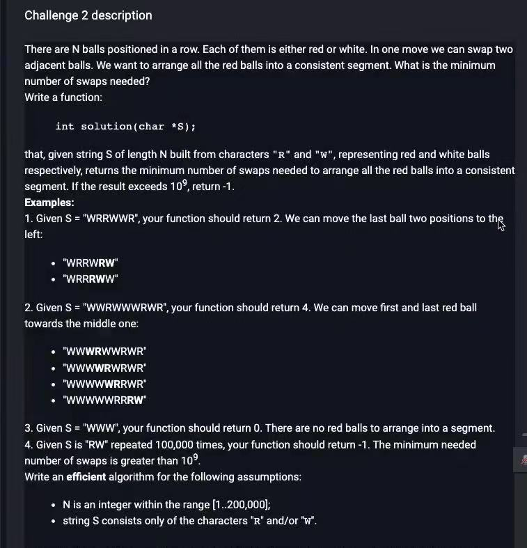

# Challenge description



# Idea

1.   Store all the indexes of `R` in a list
2.   Use two pointers `l` and `r`, number of moves should be calculated by `lst[r] - lst[l] - (r - l)`. `lst[r] - lst[l]` calculates the distance from original positions. `r - l` calculates distance after moves. The difference is number of moves.
3.   `l++; r++`

     

# Code

```java
// you can also use imports, for example:
import java.util.*;

// you can write to stdout for debugging purposes, e.g.
// System.out.println("this is a debug message");

class Solution {
    int MAX = 1000000000;
    public int solution(String s) {
        // write your code in Java 8 (Java SE 8)
        // Time Complexity: O(N)
        // Space Complexity: O(N)
        List<Integer> lst = new ArrayList<>();
        int n = s.length();
        // record all the index of R in list
        for (int i = 0; i < n; i++) {
            if (s.charAt(i) == 'R') {
                lst.add(i);
            }
        }
        int k = lst.size();
        if (k == 0) return 0;
        // base case: no red, return 0
        int l = 0, r = k - 1;
        long cnt = 0;
        while (l < r) {
            /*
            for the outmost pair <start, end>, its move should be length from original position minus length from final position
            which is reds[end_ptr] - reds[start_ptr] - end_ptr + start_ptr
            */
            cnt += lst.get(r) - lst.get(l) - (r - l);
            r--;
            l++;
        }
        return cnt <= MAX ? (int) cnt : -1;
    }
}
```

# Complexity Analysis

Time Complexity

O(N)

Space Complexity

O(N)

```python
# you can write to stdout for debugging purposes, e.g.
# print("this is a debug message")

def solution(s):
    # write your code in Python (Python 3.6)
    # Time Complexity: O(N)
    # Space Complexity: O(N)
    reds = []
    # record all the index of R in list
    for i, c in enumerate(s):
        if c == "R":
            reds.append(i)
    n = len(reds)
    # base case: no red, return 0
    if n == 0:
        return 0
    start_ptr = 0
    end_ptr = n - 1
    count = 0
    while start_ptr < end_ptr:
        # for the outmost pair <start, end>, its move should be length from original position minus length from final position
        # which is reds[end_ptr] - reds[start_ptr] - end_ptr + start_ptr
        count += reds[end_ptr] - reds[start_ptr] - end_ptr + start_ptr
        start_ptr += 1
        end_ptr -= 1
    return -1 if count > 10 ** 9 else count
```

```c++
// you can use includes, for example:
#include <algorithm>
#include <vector>
#include <set>

// you can write to stdout for debugging purposes, e.g.
// cout << "this is a debug message" << endl;

bool solution(vector<int> &A, vector<int> &B, int S) {
    // Time Complexity: O(N)
    // Space Complexity: O(N)
    set<pair<int, int>> st;// Use set to store all the pairs
    int n = A.size();
    if(n > S) return false;// base case: slots not enough
    for(int i=0; i< n; i++){
        pair<int,int> current = make_pair(A[i], B[i]);
        pair<int,int> currRev = make_pair(B[i], A[i]);
        if (st.find(current) == st.end()) st.insert(current);// if current pair no clashes, insert
        else if (st.find(currRev) == st.end()) st.insert(currRev); // else insert reverse-order.
        else return false;// else cannot.
    }
    return true;
}
```

```java
// you can also use imports, for example:
import java.util.*;

// you can write to stdout for debugging purposes, e.g.
// System.out.println("this is a debug message");

class Solution {
    int MAX = 1000000000;
    public int solution(String s) {
        // write your code in Java 8 (Java SE 8)
        // Time Complexity: O(N)
        // Space Complexity: O(N)
        List<Integer> lst = new ArrayList<>();
        int n = s.length();
        // record all the index of R in list
        for (int i = 0; i < n; i++) {
            if (s.charAt(i) == 'R') {
                lst.add(i);
            }
        }
        int k = lst.size();
        if (k == 0) return 0;
        // base case: no red, return 0
        int l = 0, r = k - 1;
        long cnt = 0;
        while (l < r) {
            /*
            for the outmost pair <start, end>, its move should be length from original position minus length from final position
            which is reds[end_ptr] - reds[start_ptr] - end_ptr + start_ptr
            */
            cnt += lst.get(r) - lst.get(l) - (r - l);
            r--;
            l++;
        }
        return cnt <= MAX ? (int) cnt : -1;
    }
}
```

```java
// you can also use imports, for example:
import java.util.*;

// you can write to stdout for debugging purposes, e.g.
// System.out.println("this is a debug message");

class Solution {
    private class Pair{
        int key;
        int val;

        @Override
        public boolean equals(Object o) {
            if (this == o) return true;
            if (o == null || getClass() != o.getClass()) return false;
            Pair pair = (Pair) o;
            return key == pair.key && val == pair.val;
        }

        @Override
        public int hashCode() {
            return Objects.hash(key, val);
        }

        public Pair(int key, int val) {
            this.key = key;
            this.val = val;
        }
    }

    public boolean solution(int[] A, int[] B, int S) {
        // write your code in Java 8 (Java SE 8)
        // Time Complexity: O(N)
        // Space Complexity: O(N)

        Set<Pair> st = new HashSet<>(); // Use set to store all the pairs
        int n = A.length;
        if (n > S) return false;;// base case: slots not enough
        for (int i = 0; i < n; i++) {
            Pair p = new Pair(A[i], B[i]);
            Pair rp = new Pair(B[i], A[i]);
            if (!st.contains(p)) st.add(p);// if current pair no clashes, insert
            else if (!st.contains(rp)) st.add(rp); // else insert reverse-order.
            else return false; //  else, connot
        }
        return true;
    }
}
```