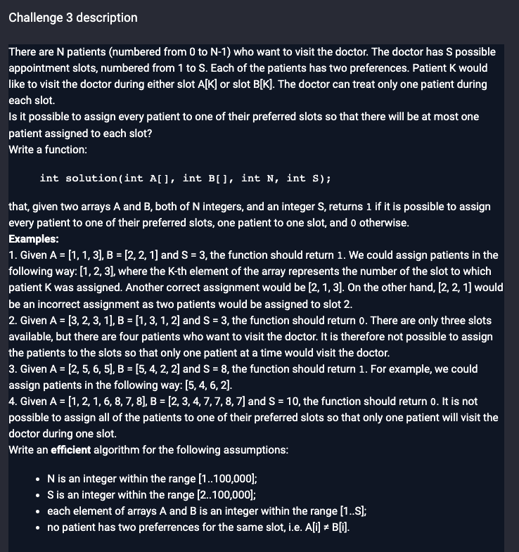

# Challenge description



# Idea

1.   For every pair, construct a `Pair` class.
1.   For every pair, construct a `Pair` and a reversed-order pair class.  `Special note for java: Pair should rewrite equals and hashCode methods`
1.   For current pair, if it is not in the set, put it. Else, if its reversed-order is not in the set, put it. Else, should return false.

# Code

```java
// you can also use imports, for example:
import java.util.*;

// you can write to stdout for debugging purposes, e.g.
// System.out.println("this is a debug message");

class Solution {
    private class Pair{
        int key;
        int val;

        @Override
        public boolean equals(Object o) {
            if (this == o) return true;
            if (o == null || getClass() != o.getClass()) return false;
            Pair pair = (Pair) o;
            return key == pair.key && val == pair.val;
        }

        @Override
        public int hashCode() {
            return Objects.hash(key, val);
        }

        public Pair(int key, int val) {
            this.key = key;
            this.val = val;
        }
    }

    public boolean solution(int[] A, int[] B, int S) {
        // write your code in Java 8 (Java SE 8)
        // Time Complexity: O(N)
        // Space Complexity: O(N)

        Set<Pair> st = new HashSet<>(); // Use set to store all the pairs
        int n = A.length;
        if (n > S) return false;;// base case: slots not enough
        for (int i = 0; i < n; i++) {
            Pair p = new Pair(A[i], B[i]);
            Pair rp = new Pair(B[i], A[i]);
            if (!st.contains(p)) st.add(p);// if current pair no clashes, insert
            else if (!st.contains(rp)) st.add(rp); // else insert reverse-order.
            else return false; //  else, connot
        }
        return true;
    }
}
```

# Complexity Analysis

Time Complexity

O(N)

Space Complexity

O(N)
