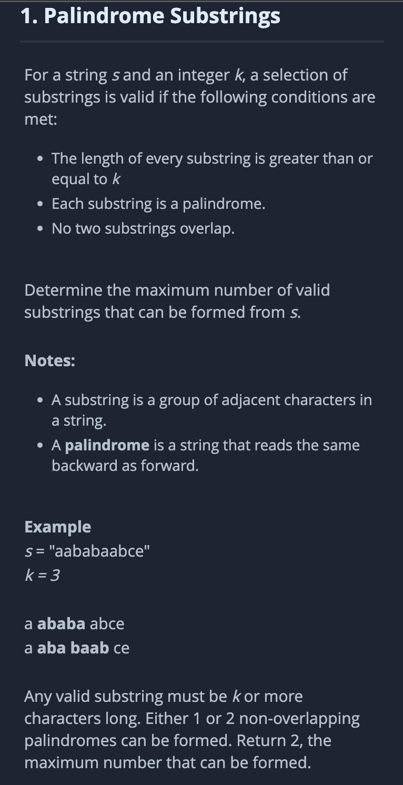
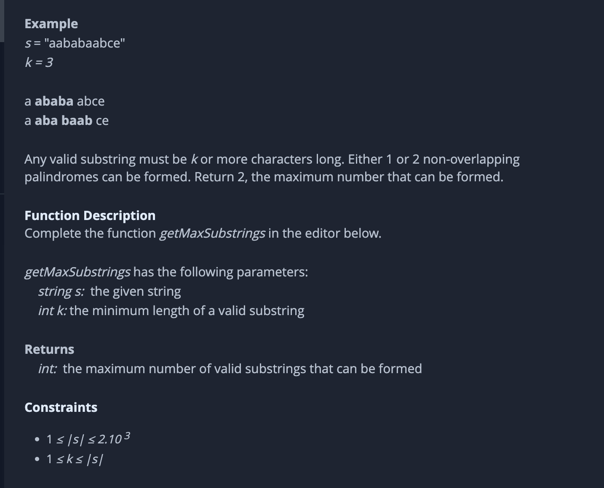

# Challenge description





# Idea

Dynamic programming.

**Definition of dp**

`DP[i]` means numbers of substrings of string whose length is `i`

**State Transfer Function**

```java
                if (i - j >= k && isPalind(s, j, i-1)) {
                  // If substring(j, i) has length >= k and is a palindrome.
                    dp[i] = Math.max(dp[i], dp[j] + 1);
                } else {
                  // dp[i] should be the max
                    dp[i] = Math.max(dp[i], dp[j]);
                }
```


**Basic Case**

`dp[0] = 0`


# Code

```java
class Result {

    /*
     * Complete the 'getMaxSubstrings' function below.
     *
     * The function is expected to return an INTEGER.
     * The function accepts following parameters:
     *  1. STRING s
     *  2. INTEGER k
     */

    public static int getMaxSubstrings(String s, int k) {
        int n = s.length();
        int[] dp = new int[n+1];// DP[i] means numbers of substrings of string whose length is i
        dp[0] = 0; // 0 for empty string
        for (int i = 0; i <= n; i++) {
            // i is the length
            for (int j = 0; j < i; j++) {
              // J is the start point 
                if (i - j >= k && isPalind(s, j, i-1)) {
                  // If substring(j, i) has length >= k and is a palindrome.
                    dp[i] = Math.max(dp[i], dp[j] + 1);
                } else {
                  // dp[i] should be the max
                    dp[i] = Math.max(dp[i], dp[j]);
                }
            }
        }
        return dp[n];
    }
    
    public static boolean isPalind(String s, int l, int r) {
        while (l < r) {
            if (s.charAt(l) !=s.charAt(r)) 
                return false;
            l++;r--;
        }
        return true;
    }

}
```

# Complexity Analysis

Time Complexity

O(N^2)

Space Complexity

O(N)

